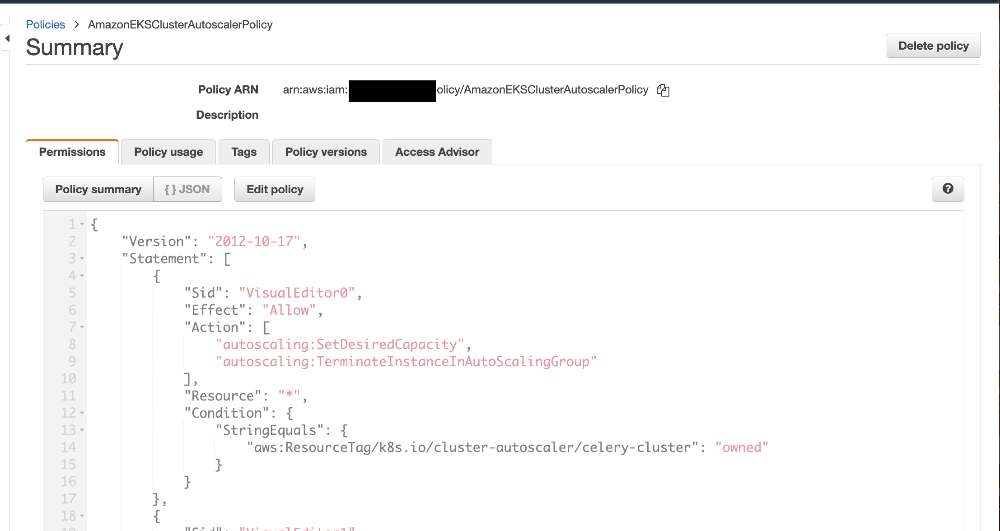
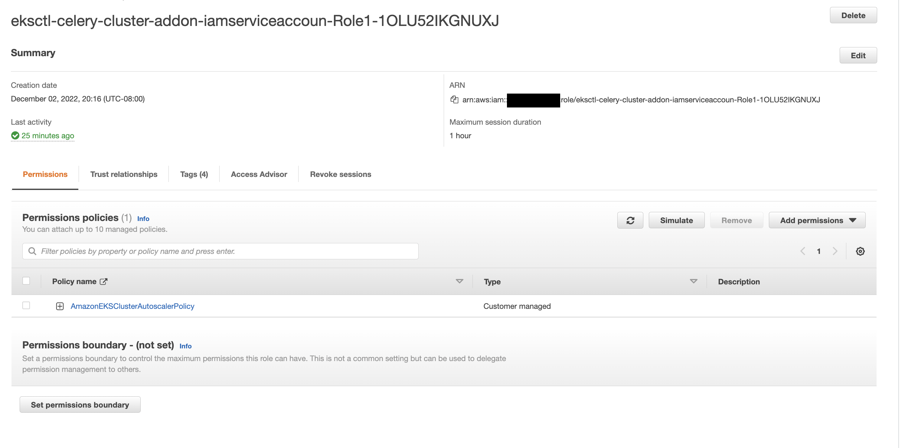
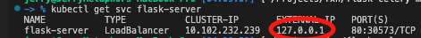
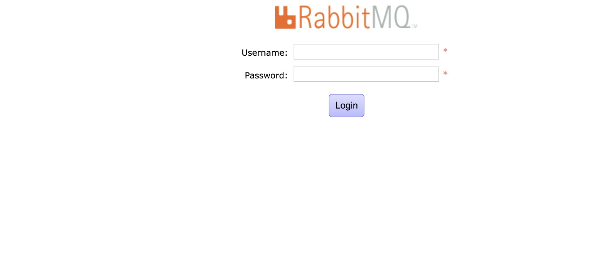
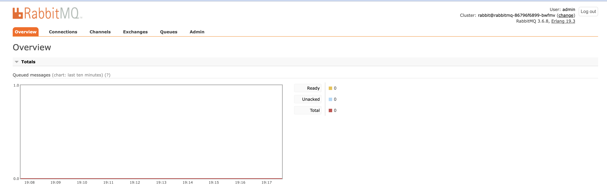
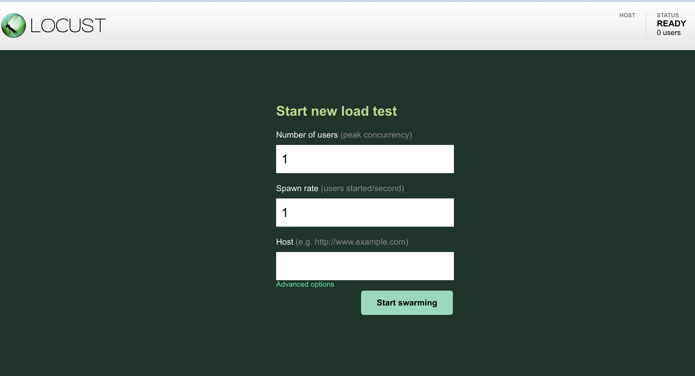

# Flask-Celery-Microservice
Demo flask api and celery worker microservice to finish long-run tasks in web-queue-worker architecture.</br>
Project refer from sample code:[flask-celery-microservice](https://github.com/yolossn/flask-celery-microservice)</br>


**NOTE**  
This is a demo project only uses 1-2 nodes to build up Kubernetes cluster. it cannot handle continuously huge amount requests which may bring down the cluster.


# Step Kubenetes cluster

Run kubernetes cluster in either AWS eks or local minikube.
## AWS setup
Setup up kubernetes cluster with AWS eks.
Refer this [tutorial](https://aws.plainenglish.io/setting-up-amazon-eks-cluster-in-the-fastest-and-easiest-way-b5de835c28c3).</br>

1. login your aws account
2. use AWS CloudShell (us-west-2)
3. Install eksctl
    ```shell
    curl --silent --location "https://github.com/weaveworks/eksctl/releases/latest/download/eksctl_$(uname -s)_amd64.tar.gz" | tar xz -C /tmp \
    && sudo mv /tmp/eksctl /usr/local/bin
    ```


4. Create Key Pair
    ```shell
    aws ec2 create-key-pair --key-name eksKeyPair --query 'KeyMaterial' --output text > eksKeyPair.pem
    ```

5. Create EKS Cluster
    ```shell
    eksctl create cluster \
    --name celery-cluster \
    --region us-west-2 \
    --node-type t2.medium \
    --nodes 1 \
    --nodes-min 1 \
    --nodes-max 5 \
    --node-volume-size 20 \
    --node-volume-type gp2 \
    --with-oidc \
    --ssh-access \
    --ssh-public-key eksKeyPair
    ```

6. Wait 20-25 minutes for cluster initiation
7. Verify cluster installation: It should show up both `Client version` and `Server version`.
   ```shell
   kubectl version
   ```

8. Pull project from github
    ```shell
    git clone https://github.com/pk1230h/flask-celery.git && cd flask-celery

9. 
    ```

10. Deploy all container microservices such as flask-api server, celery-worker server
    ```shell
    ./setup.sh
    ```


aws iam create-policy \
    --policy-name AmazonEKSClusterAutoscalerPolicy \
    --policy-document file://deploy/cluster-autoscaler-policy.json

8. Setup cluster autoscaling reference [AutoScaling](https://docs.aws.amazon.com/eks/latest/userguide/autoscaling.html#ca-deployment-considerations)
    1. Create an IAM policy.
        ```shell
        aws iam create-policy \
        --policy-name AmazonEKSClusterAutoscalerPolicy \
        --policy-document file://deploy/cluster-autoscaler-policy.json
        ```
        

    2. Create an IAM role and attach an IAM policy with eksctl
        ```shell
        eksctl create iamserviceaccount \
        --cluster=celery-cluster \
        --namespace=kube-system \
        --name=cluster-autoscaler \
        --attach-policy-arn=arn:aws:iam::${ACCOUNT_ID}:policy/AmazonEKSClusterAutoscalerPolicy  \
        --override-existing-serviceaccounts \
        --approve
        ```
        


9. Deploy the Cluster Autoscaler
    ```shell
    kubectl apply -f deploy/cluster-autoscale.yaml
    ```
    Replace with AWS account id. Copy the role arn in previous in aws console
    ```shell
    kubectl annotate serviceaccount cluster-autoscaler \
    -n kube-system \
    --overwrite=true \
    eks.amazonaws.com/role-arn=arn:aws:iam::${ACCOUNT_ID}:role/${REPALCE_WITH_AUTO_SCALE_ROLE}
    ```

**Note**
You may need to restart cluster-autscaler pod manually.
the way to do is that find the cluster-autscaler in kube-sytem and delete pod. the Kubernetes wiill auto-regenerate the pod.
```shell
kubectl get pod -n kube-system #find the cluster-autoscaler
kubectl delete pod cluster-autoscaler-xxxxxxxxxx-xxxx  -n kube-system #delete the pod
```

## Local Setup
1. Install [python3](https://www.python.org/downloads/)
2. Install [git](https://git-scm.com/book/en/v2/Getting-Started-Installing-Git)
3. Install [docker](https://docs.docker.com/get-docker/)
4. Following instructions to install [minikube](https://minikube.sigs.k8s.io/docs/start/) at local machine
    - System Requirements:  
        * 2 CPUs or more
        * 2GB of free memory
        * 20GB of free disk space

    Take macOS as an example
    ```shell
    curl -LO https://storage.googleapis.com/minikube/releases/latest/minikube-darwin-amd64
    
    sudo install minikube-darwin-amd64 /usr/local/bin/minikube

    minkube start

    alias kubectl="minikube kubectl --"

    ```


5. Verify cluster installation: It should show up both `Client version` and `Server version`.
   ```shell
   kubectl version
   ```
6. Pull project from Github
    ```shell
    git clone https://github.com/pk1230h/flask-celery.git && cd flask-celery
    ```
7. Deploy all container microservices such as flask-api server, celery-worker server
    ```shell
    ./setup.sh
    ```
8. Make flask server, rabbitmq public access, open new terminal
    ```shell
    minikube tunnel
    ```

##  API Request
make api call to trigger celery worker process given flask API url and number of requests
1. Install needed liberaies to make api call
    ```shell
    ./client_setup.sh
    ```

2. Copy flask server load balancer url from kubectl service
   
    ```shell
    kubectl get svc flask-server
    ```
    

2. Trigger api request
    ```shell
    python client/client_request.py http://${URL} -n ${NUMBER_OF_REQUESTS}
    ```
    Example
    ```shell
    python client/client_request.py http://127.0.0.1 -n 20
    ```

## Observe 
Observe queue and message status for debugging purpose
copy the rabbitmq-mnt from kubernetes service
```shell
kubectl get svc rabbitmq-mgnt -n rabbitmq
```

open broswer with  http://`${RABBITMQ_URL}`:15672
```shell
username: admin
password: secretpassword
```



## Load Test:
Use locust to test the loading whether break the Kubernetes server

```shell
docker run -p 8089:8089  -v $PWD:/mnt/locust  locustio/locust -f /mnt/locust/test/load_test.py
```
use the flask-server load balancer url as host


**NOTE**
only use for aws eks cluster which have ability to do node horizontal scaling,
otherwise, test in lower rate for local kubernetes